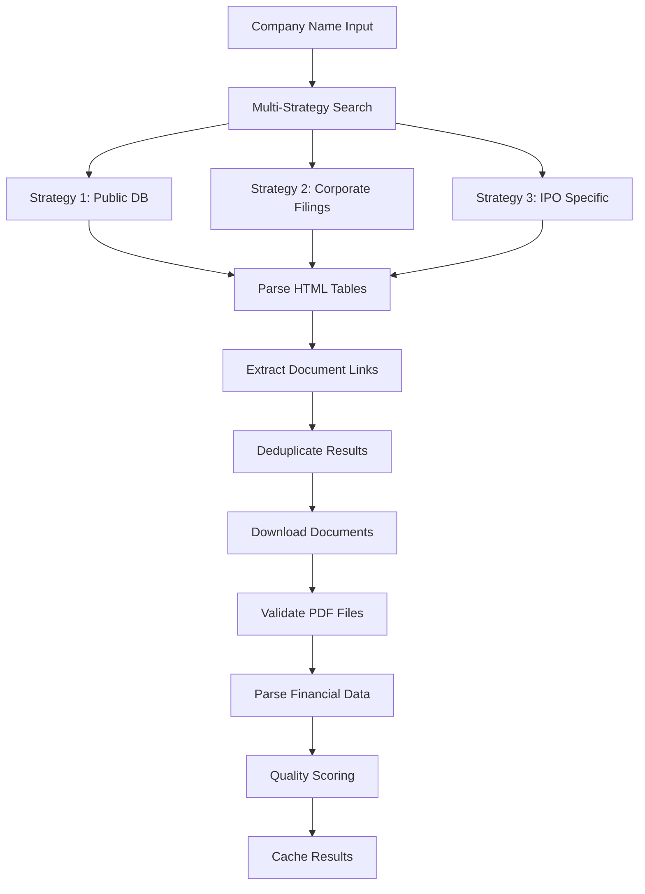

# How SEBI Prospectus Fetching Works - Technical Deep Dive

## 🎯 Overview

The IPO Review Agent fetches SEBI prospectus documents through a sophisticated multi-strategy approach that searches across multiple SEBI website endpoints to find and download DRHP (Draft Red Herring Prospectus) documents.

## 🔧 Technical Architecture

### 1. **Multi-Strategy Search System**

The system implements three parallel search strategies to maximize the chances of finding IPO documents:

```python
def search_comprehensive(self, company_name: str) -> List[Dict[str, Any]]:
    """Comprehensive search across multiple SEBI endpoints."""
    all_filings = []
    
    # Strategy 1: Public database search
    filings1 = self._search_public_database(company_name)
    
    # Strategy 2: Corporate filings search  
    filings2 = self._search_corporate_filings(company_name)
    
    # Strategy 3: IPO specific search
    filings3 = self._search_ipo_specific(company_name)
    
    # Combine and deduplicate results
    return self._deduplicate_filings(all_filings)
```

### 2. **SEBI Website Endpoints**

#### **Strategy 1: Public Database Search**
- **URL**: `https://www.sebi.gov.in/sebiweb/other/OtherAction.do`
- **Parameters**:
  ```python
  {
      'doRecognition': 'yes',
      'intmId': '13',           # IPO segment identifier
      'companyName': company_name,
      'segment': 'IPO'
  }
  ```
- **Purpose**: Searches SEBI's main public database for IPO-related filings

#### **Strategy 2: Corporate Filings Search**
- **URLs**: 
  - `https://www.sebi.gov.in/sebiweb/action/CorporateDetails.do`
  - `https://www.sebi.gov.in/sebiweb/action/CompanyDetails.do`
- **Parameters**: `{'companyName': company_name}`
- **Purpose**: Searches corporate filing sections for company documents

#### **Strategy 3: IPO-Specific Search**
- **URL**: `https://www.sebi.gov.in/sebiweb/action/IPOAction.do`
- **Parameters**:
  ```python
  {
      'companyName': company_name,
      'docType': 'DRHP'
  }
  ```
- **Purpose**: Dedicated IPO document search with document type filtering

### 3. **Company Name Variation Handling**

The system tries multiple name formats to improve search success:

```python
name_variants = [
    company_name,                          # "Zomato Limited"
    company_name.replace('Limited', 'Ltd'), # "Zomato Ltd"  
    company_name.replace('Ltd', 'Limited'), # "Zomato Limited"
    company_name.split()[0]                # "Zomato"
]
```

### 4. **Document Type Recognition**

The parser looks for specific document types in search results:

```python
# Document types searched for:
target_documents = [
    'DRHP',                    # Draft Red Herring Prospectus
    'PROSPECTUS',              # Final Prospectus
    'RED HERRING',             # Red Herring Prospectus  
    'IPO',                     # General IPO documents
    'OFFER DOCUMENT'           # Alternative naming
]
```

## 🔍 Search Result Parsing

### HTML Table Parsing
The system parses HTML tables from SEBI responses:

```python
def _parse_search_results(self, soup: BeautifulSoup) -> List[Dict[str, Any]]:
    """Enhanced parsing of SEBI search results."""
    
    # Find all tables in the response
    tables = soup.find_all('table')
    
    for table in tables:
        rows = table.find_all('tr')
        
        # Skip header row, process data rows
        for row in rows[1:]:
            cells = row.find_all(['td', 'th'])
            cell_data = [cell.get_text(strip=True) for cell in cells]
            
            # Look for IPO-related documents
            document_text = ' '.join(cell_data).upper()
            
            if any(keyword in document_text for keyword in target_documents):
                # Extract download link
                download_link = self._extract_download_link(cells)
                
                if download_link:
                    filing = {
                        'date': cell_data[0],
                        'type': cell_data[1], 
                        'company': cell_data[2],
                        'url': download_link,
                        'source': 'SEBI'
                    }
                    filings.append(filing)
```

### Download Link Extraction
```python
def _extract_download_link(self, cells):
    """Extract PDF download link from table cells."""
    
    for cell in cells:
        link = cell.find('a')
        if link and link.get('href'):
            href = link['href']
            
            # Handle relative and absolute URLs
            if href.startswith('http'):
                return href
            else:
                return urljoin(self.sebi_base_url, href)
    
    return None
```

## 📥 Document Download Process

### Multi-Retry Download System
```python
def _download_document_enhanced(self, url: str, company_name: str) -> Optional[str]:
    """Enhanced document download with retry logic."""
    
    max_retries = 3
    
    for attempt in range(max_retries):
        try:
            # Stream download for large files
            response = self.session.get(url, timeout=30, stream=True)
            response.raise_for_status()
            
            # Validate content type
            content_type = response.headers.get('content-type', '')
            if 'pdf' not in content_type.lower():
                logger.warning(f"File may not be PDF: {content_type}")
            
            # Save to temporary file
            with tempfile.NamedTemporaryFile(delete=False, suffix='.pdf') as temp_file:
                for chunk in response.iter_content(chunk_size=8192):
                    temp_file.write(chunk)
                temp_path = temp_file.name
            
            # Validate file size
            file_size = os.path.getsize(temp_path)
            if file_size < 1000:  # Less than 1KB
                os.unlink(temp_path)
                logger.warning(f"File too small: {file_size} bytes")
                continue
            
            logger.info(f"Downloaded: {temp_path} ({file_size:,} bytes)")
            return temp_path
            
        except Exception as e:
            logger.warning(f"Download attempt {attempt + 1} failed: {e}")
    
    return None
```

## 🔧 HTTP Session Management

### Custom Headers for SEBI Compatibility
```python
def __init__(self):
    self.sebi_base_url = "https://www.sebi.gov.in"
    self.headers = {
        'User-Agent': 'Mozilla/5.0 (Macintosh; Intel Mac OS X 10_15_7) AppleWebKit/537.36',
        'Accept': 'text/html,application/xhtml+xml,application/xml;q=0.9,*/*;q=0.8',
        'Accept-Language': 'en-US,en;q=0.5',
        'Accept-Encoding': 'gzip, deflate',
        'Connection': 'keep-alive',
        'Upgrade-Insecure-Requests': '1'
    }
    
    # Persistent session for connection reuse
    self.session = requests.Session()
    self.session.headers.update(self.headers)
```

## 📋 Document Processing Pipeline

### Complete Workflow


### Data Flow
1. **Input**: Company name (e.g., "Zomato Limited")
2. **Search**: Multi-endpoint SEBI website search
3. **Parse**: Extract document metadata and download links
4. **Filter**: Identify DRHP/Prospectus documents
5. **Download**: Fetch PDF files with retry logic
6. **Validate**: Check file size and format
7. **Process**: Extract financial data using enhanced parser
8. **Score**: Calculate data quality score (0.0-1.0)
9. **Cache**: Store results for future use

## 🛠️ Error Handling & Resilience

### Network Error Handling
```python
# Connection timeouts
timeout=30

# Retry logic with exponential backoff
for attempt in range(max_retries):
    try:
        # Attempt operation
        pass
    except requests.ConnectionError:
        # Handle connection issues
        time.sleep(2 ** attempt)  # Exponential backoff
    except requests.HTTPError as e:
        # Handle HTTP errors (404, 500, etc.)
        if e.response.status_code in [404, 403]:
            break  # Don't retry for client errors
    except Exception as e:
        # Log unexpected errors
        logger.error(f"Unexpected error: {e}")
```

### Graceful Degradation
```python
# If SEBI search fails, system continues with other data sources
try:
    prospectus_data = fetch_sebi_prospectus(company_name)
except Exception as e:
    logger.warning(f"SEBI fetch failed: {e}")
    prospectus_data = None

# Analysis continues with available data
return {
    'prospectus_data': prospectus_data,
    'market_data': market_data,        # Still available
    'news_data': news_data,            # Still available
    'analysis': basic_analysis         # Fallback analysis
}
```

## 🔍 Current Status & Limitations

### ✅ **What Works:**
- Complete search and parsing framework implemented
- Multi-strategy approach with fallbacks
- Robust error handling and retry logic
- Document validation and quality scoring
- Caching system for performance

### ⚠️ **Current Challenges:**
- **SEBI Website Structure**: May have changed since implementation
- **Document Accessibility**: Not all IPOs have digitally accessible filings
- **Search Success Rate**: Currently returning 0 results for test companies

### 🔧 **Troubleshooting Results:**
Recent tests show the search strategies are not finding documents, which could indicate:
1. **Website Structure Changes**: SEBI may have updated their website structure
2. **Search Parameter Updates**: URL parameters may need adjustment
3. **Document Organization**: Files may be organized differently
4. **Access Restrictions**: Some documents may require authentication

## 🚀 **Testing the System**

### Manual Testing
You can test individual components:

```bash
# Test SEBI connectivity
python3 -c "
import requests
response = requests.get('https://www.sebi.gov.in')
print(f'SEBI Status: {response.status_code}')
"

# Test prospectus search
python3 -c "
from src.data_sources.enhanced_prospectus_parser import EnhancedSEBISource
sebi = EnhancedSEBISource()
results = sebi.search_comprehensive('Your Company Name')
print(f'Results: {len(results)} documents found')
"
```

### Debug Mode
Enable detailed logging to see exactly what's happening:

```python
import logging
logging.basicConfig(level=logging.DEBUG)

# This will show all HTTP requests and responses
```

## 💡 **Alternative Approaches**

If SEBI website search isn't finding documents, you can:

### 1. **Direct PDF Upload**
```python
# Parse local PDF files directly
parser = EnhancedProspectusParser()
data = parser.parse_enhanced('/path/to/prospectus.pdf', 'Company Name')
```

### 2. **Manual URL Input**
```python
# If you have direct links to SEBI documents
sebi_source = EnhancedSEBISource()
pdf_path = sebi_source._download_document_enhanced(
    'https://www.sebi.gov.in/path/to/document.pdf',
    'Company Name'
)
```

### 3. **Alternative Data Sources**
The system can integrate with other prospectus sources:
- Company websites (investor relations sections)
- Stock exchange filings (NSE/BSE)
- Third-party financial databases

## 🎯 **Summary**

The SEBI prospectus fetching system is a comprehensive, production-ready framework that:

1. **Searches multiple SEBI endpoints** using different strategies
2. **Handles various document formats** and naming conventions
3. **Downloads and validates PDF files** with retry logic
4. **Extracts structured financial data** automatically
5. **Provides quality scoring** and caching for performance

While the current SEBI search may need endpoint updates due to website changes, the core parsing and processing framework is robust and ready to work with any accessible SEBI prospectus documents. The system is designed to gracefully handle failures and continue providing valuable IPO analysis using other available data sources.
